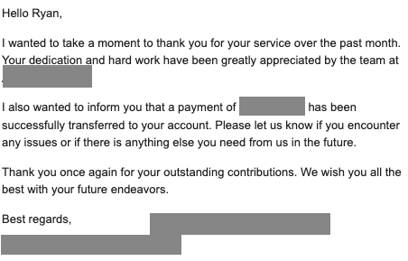

This is the story of how I gained enough courage to finally start something on my own. To provide a bit of context, I was a business student. I studied Business Administration which honestly, was not something I wanted to do in the first place. But anyways, after getting peer pressured into choosing a major I didn't like, I graduated.

 

To me, business was all about learning how to market a product. It feels as if they're teaching you how to be an employee, not an employer. They will teach you how to do things you're supposed to do in the office, and they don't teach you how to bootstrap things that aren't perfect but may one be of help to other people.

 

Like it or not, I had to follow through. During my 4 years of college, I realized :

 

I need to learn how to build something. I knew that I know how to market something, just not how to build it. I can't market if a product doesn't exist. Then, I knew no matter how much I hated the idea of dong business ___( how foolish of me )___ I knew that one day the knowledge will come in handy.

 

So to buy a bit more time to stay here and made a bit of money, I decided to learn to code while I continue my MBA and teach English to get a bit of an income myself and not rely as much on my parents. I know, digging myself into a deeper hole.

 

<h1 class="text-3xl font-bold">
 Fast Forward 2 Years Later
</h1>

 

Not much has changed, I was exactly at the same place that I was 2 years ago. The same lost kid with no idea what he had wanted to do in life, with a wee bit more money in his pocket.

 

I understood Next JS by that point, I knew React, I knew Javascript, and the basics of HTML and CSS. I can make my own websites! and SPAs, I was trying to learn all that I could and made resumes here and there, but I was still stuck where I was. I taught English 4-5 times a week, making decent money, with less than 12 hours per week.

 

Remember how I made made a few resumes here and there? Well it clicked, I got a job offer.

 

<h1 class="text-3xl font-bold">
The Big Break... Or What Seemed Like It
</h1>

 

I woke up one morning with an offer for a marketing position for an AI Startup in the interior design industry, with a 6 month probation period and a salary that's 30% above the minimum wage, and paid lunch breaks. As a fresh graduate, it was everything I had hoped for. It sounded so good, and it was a great opportunity, to set myself up for better things.

 

My parents were excited about it, and so was I. I started making plans for the future, how I'm going to save my money, and was making promises to my girlfriend.

 

So I started my job. My job was to assist in marketing, so I had a few things I needed to do. I had to email churned customers, make ad creatives, and also YouTube videos. Our focus was making long form content to introduce our product to the masses because people were finding it difficult to navigate, and allocating time and resources for our UI were less important than developing new tools that improve the usability of our Saas.

 

As days gone by, I started to form connections, and learn a few things here and there. They gave me a little bit of coding, because I wanted to become a developer if I have the chance. I was inspired by the founder, who was working closely with us the entire time, and I had to ask him some questions about how he started his own company.

 

I found out about Pieter Levels, and I eventually understood that there were people out there making their own money, coding for a living. The Indie Hacker community was real. It was a lingering dream behind my head that was always so far away, until now.

 

I made videos, as how I should, and gathered feedback, but our social media was not performing as expected. I tried to find the solutions, I developed a blogging system for our Saas, and it was ditched because we had other priorities. After 29 days of my new job... I got this email :

<h1 class="text-3xl font-bold">
What's Next? ( pun intended )
</h1>

 

Well... if there's one thing I can learn, or if there's 1 silver lining for me to see here, is that I fell in love with coding. The idea of building something with just a keyboard and a screen, from home, is just... truly mesmerizing to me. Seeing so many people hammer themselves for a 9-5 to one day hope for a promotion... just doesn't really seem like me. Even though I only tried it for a month...

 

Nevertheless, as per 5th of October 2024, I'm currently refining my coding skills, and making this blog!

 

___What would you do if you were me? Would you try again and find another corporate job? Because sometimes I feel like this whole entrepreneurship thing, is just a coping mechanism. But deep down, I feel this kind of interest in making money without going to an office.___
