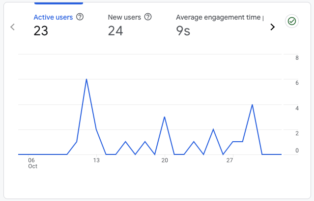

This weeks' a bit better, but still not much traction yet. But there are some new things for this week! First of all, I have something to celebrate with you guys!

 

 

Woohooo! We have 28 viewers for my blog! 🎉 I know it's not much, but I know some people are reading this and I want to say thanks to you guys if you are reading this.

 

<h1 class="text-3xl font-bold">
Next JS 15 is out
</h1>

 

Honestly, I haven't read much about it, but there are some new hooks, like Optimistic UI Updates, there's no more caching for fetch and route handlers, and some more dope things I can't wait to get into.

 

<h1 class="text-3xl font-bold">
Stuck On My Thesis
</h1>

 

Didn't have much time to code this past week, my thesis deadline is coming up and I've been putting my everything into it. I'm doing a thesis on the preference between AI generated workout programs compared to human based workout programs. Right now, I'm formulating the theory and research framework first. It's definitely the hardest part. Explained in programming terms, I have to find out the factors impacting why participants would choose one program over the other, and then find a boolean answer through a quantitative survey to check if a certain attribute made participants chose one program over the other.

 

Actually, the method that I'm using has been used many times before and it's called the DCE method. It's a method where we can find out why someone chooses something. It's actually quite interesting.

 

<h1 class="text-3xl font-bold">
Lessons I Learned
</h1>

 

While I was on my commute to work, I listened to some podcasts, and here are a few things I want to remember this week :

 

<h3 class="text-2xl font-bold italic">A Part of Being Means To Exhaust Oneself in Being</h3>

 

Jordan Peterson stated that being, a part of being, being a human being is to exhaust oneself in becoming better. We as humans are not meant for complacency, we are always expanding our horizon, traveling and going further than from where we are, leaving where we were born, exploring, and discovering the uncertainties beyond the borders of our comfort zone. Naturally, less things are under our control.
There are more risks out there than what we are used to handling.

 

<h3 class="text-2xl font-bold italic">Entrepreneurship is making the unknown into known through continuous trial and error</h3>

 

This one, is by Alex Hormozi. I can't even begin to tell you guys how much you can learn from just listening to his 30 minute podcast. I feel like this is correct? Somehow moving forward feels difficult when you don't know what you're doing, it's really hard, because you don't know when, or if the things you're doing, the seeds you're planting will come to fruition or not. But this is where we're wrong.

 

<h3 class="text-2xl font-bold italic">Think About Showing Up Instead of The Results You'll Get By Showing Up</h3>

 

I find this to be very paradoxical? Because by focusing on the short term, you can guarantee that things will work out in the long term? I do believe this is right though, it's really hard to feel like you're doing any work if you don't see results in an instant.

 

<h3 class="text-sm italic font-light">I feel like this blog is getting more and more jumbled, but you can read and expect the same thing each week, I'll update insights, projects progress, things I learned, and some things I learned from my podcast sessions. Thanks for showing up! See y'all next week.</h3>
